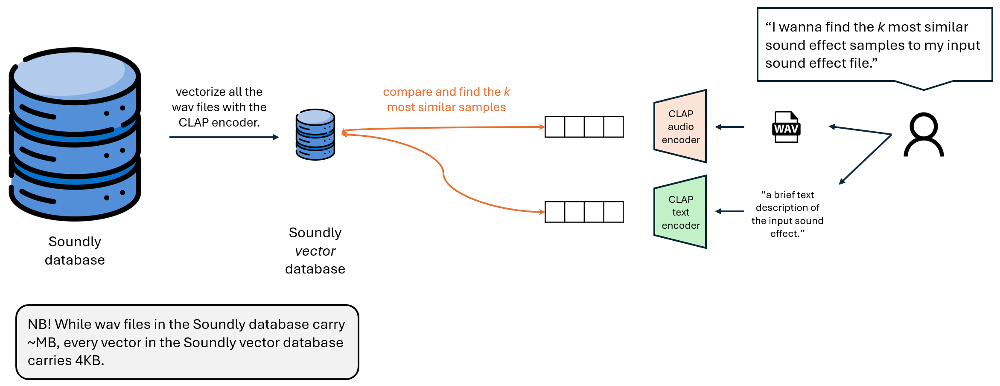

# Sound Effect Vector Search Demo

**Author:** Daesoo Lee  
**Company:** HANCE  

---

## Introduction

Welcome to the demo of our new method for Sound Effect Vector Search. This project aims to find the top **k** most similar sound effect files from the **Soundly database** based on a given audio file and/or text description. By providing both an audio reference and a text description, users can achieve the most accurate search results. However, the system is flexible and allows searches using either input individually.

## Method

The image illustrates a method for retrieving the most similar sound effects from a database based on a given input sound or text description, using vector search. Here's how the process works:

1. **Soundly Database**: This is the primary source of sound effects stored in WAV file format. These files are typically large (several MBs each).
   
2. **Vectorization of Sound Files**: All the sound files in the Soundly database are vectorized using a **CLAP (Contrastive Language-Audio Pretraining)** encoder. The CLAP encoder transforms the sound files into vectors (embeddings), which represent the audio in a lower-dimensional space. These vectors are much smaller (4KB per vector).

3. **Soundly Vector Database**: Once vectorized, the sound files are stored in a vector database, which is more compact and efficient for similarity searches.

4. **Input Query**: The user can input either or both:
   - A **WAV file** of a sound effect, which will be processed by the **CLAP audio encoder** to generate a vector, 
   - A **text description** of the desired sound effect, which is vectorized using the **CLAP text encoder**.

5. **Similarity Search**: The system compares the input vector (from either the audio and/or text query) to the vectors stored in the Soundly vector database. Using similarity metrics, the system retrieves the **k most similar sound effect samples** to the input.

6. **Output**: The user receives the most similar sound effects from the database based on their input (either from an audio file or a brief text description).

<!-- ## Computational Efficiency

Efficiency is a critical aspect of our system, especially when dealing with large databases like Soundly. To ensure rapid search responses, we have implemented:

- **Vector Indexing:** Using efficient data structures like KD-Trees for quick nearest neighbor searches.
- **Dimensionality Reduction:** Applying techniques such as PCA to reduce computation without significant loss of accuracy.
- **Parallel Processing:** Leveraging multi-threading and GPU acceleration where applicable. -->

## Experiments

### Experimental Setup
For the sake of initial experiments, the sound files under the "Bells" category in the Soundly database are used for the vector database.

## Experimental Results
Below we present sample results from our system. Audio samples are provided to demonstrate the effectiveness of our search method.

### A. User Input: Reference Audio + Text Description

**Reference Audio:** [Audio Sample 1](.audio/search_query/bicycle_bell.wav)
**Text Description:** "Crashing ocean waves with distant seagulls"

| Rank | Similar Audio |
|------|---------------|
| 1    | [Audio Match 1](#) |
| 2    | [Audio Match 2](#) |
| 3    | [Audio Match 3](#) |
| 4    | [Audio Match 4](#) |
| 5    | [Audio Match 5](#) |

### B. User Input: Reference Audio

**Reference Audio:** [Audio Sample 2](#)

| Rank | Similar Audio |
|------|---------------|
| 1    | [Audio Match 1](#) |
| 2    | [Audio Match 2](#) |
| 3    | [Audio Match 3](#) |
| 4    | [Audio Match 4](#) |
| 5    | [Audio Match 5](#) |

### C. User Input: Text Description

**Text Description:** "Heavy thunderstorm with pouring rain"

| Rank | Similar Audio |
|------|---------------|
| 1    | [Audio Match 1](#) |
| 2    | [Audio Match 2](#) |
| 3    | [Audio Match 3](#) |
| 4    | [Audio Match 4](#) |
| 5    | [Audio Match 5](#) |

---

Feel free to explore the demo and experience the seamless integration of audio and text in searching for the perfect sound effect.